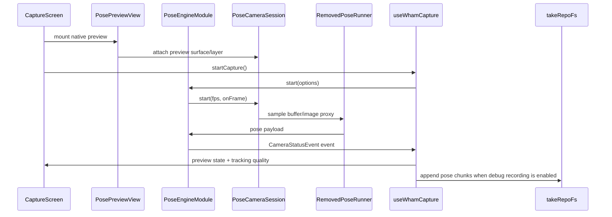

# Current Codebase Audit

## Production Boundary

MocapExpo is moving from local pose-frame solving to a backend-core capture pipeline. The production source of truth is now:

```text
original video file + capture metadata
```

Local pose frames remain useful, but only as live preview, capture quality telemetry, and debug/reference artifacts for validating backend output.

## Existing Capture Flow



## Classification

| Area | Current role | Backend-core role |
| --- | --- | --- |
| `PoseEngineModule` | Native camera bridge | Preview and video recording lifecycle |
| `PoseCameraSession` | Camera preview + frame stream | Shared camera session for preview, pose inference, and file recording |
| `useWhamCapture` | Pose stream + recorder orchestration | Preview, quality accumulation, and capture lifecycle facade |
| `useRecorder` | Local pose-frame recorder | Production video recorder facade; local pose chunks only under debug flag |
| `takeRepoFs` | Local take/chunk persistence | Debug/reference persistence and offline development store |
| `TakeExporter` and export pipeline | Local export generator | Debug/reference path and backend worker reference implementation |
| Dual-camera prototype | Live landmark pairing/triangulation | UX/math reference for later multi-video backend reconstruction |
| Empty DI/services | Unused | Stable mobile service boundary for backend-core clients |

## Technical Gaps

1. Native camera currently emits preview frames but did not produce durable video files.
2. Local exports are generated from estimated pose frames, not original video.
3. No backend API, object storage, processing job, or upload state machine existed.
4. No shared capture metadata schema existed between mobile and backend.
5. Root QA is limited to `typecheck` and `bundle:check`; backend/native CI must be added as the backend-core grows.

## Decisions

1. Do not delete local export or pose-frame persistence. Keep them behind debug/reference paths.
2. Production uploads must include one original video and one metadata JSON per capture device.
3. Processing jobs may not be created until required upload parts are marked complete.
4. Backend owns project/take/upload/job/export orchestration.
5. Worker owns video ingest, pose extraction, reconstruction, cleanup, and export generation.
