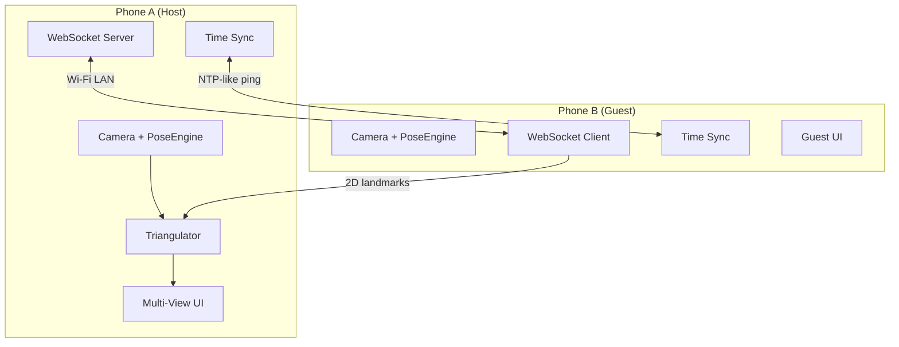

# Çift Telefon Triangülasyon & P2P Haberleşme

## Amaç

MocapExpo uygulamasına iki telefonun aynı anda aynı sahneyi farklı açılardan çekmesi, kendi aralarında haberleşmesi, ve 2D pose landmark'larını stereo triangülasyon ile gerçek 3D koordinatlara dönüştürmesi özelliğini eklemek.

## Mevcut Durum

- **Tek telefon** kamerayla MediaPipe Pose 33 landmark çıkarıyor (`PoseEngine.native.ts`)
- Frame'ler `usePoseStream` → `useRecorder` → `takeRepoFs` zinciriyle kaydediliyor
- Mevcut `worldLandmarks` MediaPipe'ın monoküler derinlik tahmini — gerçek metrik 3D değil
- **P2P haberleşme veya multi-device altyapısı yok**

## Mimari Genel Bakış



**Roller:**
- **Host (Phone A):** WebSocket server çalıştırır, kalibrasyon akışını yönetir, triangülasyon hesaplar, birleşik 3D pose'u kaydeder
- **Guest (Phone B):** Host'a bağlanır, kendi 2D landmark'larını gönderir, komutları alır (start/stop record)

---

## User Review Required

> [!IMPORTANT]
> **Haberleşme Yöntemi:** WebSocket over Wi-Fi LAN seçildi. Her iki telefon aynı Wi-Fi ağında olmalı. Host telefon basit bir WS server çalıştırır. Bu, en az dependency ile çalışan, en hızlı geliştirilebilen yaklaşım. Multipeer Connectivity (iOS-only) veya WebRTC gibi daha karmaşık alternatifler de var ama ilk versiyon için WS yeterli.

> [!IMPORTANT]  
> **Triangülasyon Kalitesi:** İki kamera ile DLT triangülasyon yapılacak. Kameraların 60-120° arası açıyla yerleştirilmesi ve bir stereo kalibrasyon adımı (checkerboard veya "known distance" ile) gerekli. İlk versiyonda **simplified calibration** (bilinen bir referans mesafe + iki kameranın göreceli pozisyonu) kullanılacak.

> [!WARNING]
> **Native Dependency:** WebSocket server tarafı için `react-native-tcp-socket` veya benzeri bir native modül gerekebilir. Alternatif olarak, eğer her iki cihaz aynı LAN'daysa, bir telefonun IP'sini manuel girip standart `WebSocket` API kullanılabilir (React Native'de built-in). İlk versiyonda **built-in WebSocket** ile gideceğiz — ekstra native dependency yok.

## Open Questions

> [!IMPORTANT]
> 1. **Host nasıl seçilecek?** Kullanıcı uygulamada "Host" veya "Guest" rolü seçecek mi, yoksa otomatik mı olsun? → **Öneri: UI'da açık seçim (Host/Guest toggle)**
> 2. **Kalibrasyon yöntemi:** Checkerboard pattern mi kullanılsın, yoksa "iki telefon arasına bilinen bir nesne koy ve landmark'ları eşle" basit yaklaşım mı? → **Öneri: İlk versiyon için "known reference distance" — kullanıcı sahneye bilinen uzunlukta bir obje koyar, iki kameradan da noktaları işaretler**
> 3. **Frame senkronizasyonu:** İki telefonun frame timestamp'leri farklı olacak. NTP-like ping/pong ile clock offset hesaplanacak. Bu yeterli mi, yoksa daha hassas bir sync gerekli mi? → **Öneri: İlk versiyonda ±10ms hassasiyet yeterli, NTP-like yaklaşım uygun**
> 4. **Guest telefonda da kayıt yapılsın mı?** Yoksa guest sadece 2D landmark göndersin mi? → **Öneri: Guest sadece landmark göndersin, birleşik 3D kayıt host'ta yapılsın**

---

## Proposed Changes

Değişiklikler 6 faz olarak planlandı:

### Faz 1: P2P Networking Altyapısı

Telefon-telefon haberleşme katmanı. Host bir WS server, Guest ona bağlanan client.

#### [NEW] [PeerProtocol.ts](file:///Users/burakcoskun/Mocapexpo/src/infra/networking/PeerProtocol.ts)
- P2P mesaj tipleri ve protocol tanımları
- Message types: `handshake`, `time_sync_req`, `time_sync_res`, `frame_data`, `command` (start/stop/calibrate), `calibration_data`, `status`
- Her mesajda: `type`, `ts`, `deviceId`, `seq`, `payload`

#### [NEW] [PeerHost.ts](file:///Users/burakcoskun/Mocapexpo/src/infra/networking/PeerHost.ts)
- React Native'de "server gibi davranan" WebSocket handler
- Aslında bir telefon HTTP server çalıştıramaz doğrudan — bunun yerine **bir relay yaklaşımı** veya **`react-native-tcp-socket`** kullanılacak
- **Alternatif (daha basit):** Host telefon kendi IP'sini gösterir, Guest o IP'ye bağlanır. Host tarafında `react-native-tcp-socket` ile basit bir TCP/WS server ayağa kaldırılır
- Bağlantı state management, client tracking

#### [NEW] [PeerGuest.ts](file:///Users/burakcoskun/Mocapexpo/src/infra/networking/PeerGuest.ts)  
- WebSocket client — Host'un IP:port'una bağlanır
- Built-in `WebSocket` API kullanır (React Native'de native)
- Auto-reconnect, exponential backoff
- Frame gönderimi (2D landmark'lar, kompakt binary format)

#### [NEW] [TimeSync.ts](file:///Users/burakcoskun/Mocapexpo/src/infra/networking/TimeSync.ts)
- NTP-like clock synchronization
- Ping/pong round-trip ile offset hesaplama
- En az 5 sample alıp median offset kullanma
- Guest timestamp → Host timestamp dönüşümü

---

### Faz 2: Stereo Kalibrasyon

İki kameranın göreceli pozisyonunu bulmak için kalibrasyon akışı.

#### [NEW] [StereoCalibration.ts](file:///Users/burakcoskun/Mocapexpo/src/domain/mocap/pipeline/calibration/StereoCalibration.ts)
- `StereoCalibrationResult`: rotation matrix (R), translation vector (T), fundamental matrix (F)
- Camera intrinsics estimation (telefon kamera parametreleri — FOV'dan yaklaşık hesap)
- Projection matrix (P) oluşturma: `P = K * [R | t]`

#### [NEW] [StereoCalibrationWizard.tsx](file:///Users/burakcoskun/Mocapexpo/src/features/capture/components/StereoCalibrationWizard.tsx)
- Adım adım UI:
  1. "İki telefonu yerleştirin, aynı kişiyi görün"
  2. "Kişi A-pose'a geçsin" → her iki kameradan aynı anda landmark yakala
  3. "Kişi 1 adım sola/sağa gitsin" → tekrar yakala
  4. Eşleşen landmark çiftlerinden R, T hesapla
- Kalibrasyon kalite skoru gösterimi

#### [MODIFY] [CalibrationAnalyzer.ts](file:///Users/burakcoskun/Mocapexpo/src/domain/mocap/pipeline/calibration/CalibrationAnalyzer.ts)
- Mevcut tek-kamera kalibrasyon analizine ek olarak stereo kalibrasyon durumu eklenmesi

---

### Faz 3: Triangülasyon Pipeline'ı

İki kameradan gelen 2D landmark çiftlerini gerçek 3D'ye dönüştürme.

#### [NEW] [Triangulator.ts](file:///Users/burakcoskun/Mocapexpo/src/domain/mocap/pipeline/triangulation/Triangulator.ts)
- **DLT (Direct Linear Transform)** triangülasyon implementasyonu
- Input: 2D landmark (x,y) from Camera A, 2D landmark (x,y) from Camera B, Projection matrices P1 & P2
- Output: 3D point (X, Y, Z) in world coordinates
- SVD çözümü (basit 4x4 linear system, Math.js bağımlılığı olmadan pure TS)
- Batch triangulation: tüm 33 landmark'ı aynı anda çevirme

#### [NEW] [FrameMatcher.ts](file:///Users/burakcoskun/Mocapexpo/src/domain/mocap/pipeline/triangulation/FrameMatcher.ts)
- İki kameradan gelen frame'leri timestamp'e göre eşleştirme
- Clock offset uygulama (TimeSync'ten)
- Configurable tolerance (default ±16ms — yaklaşık 1 frame at 60fps)
- Missing frame interpolation (önceki frame ile)

#### [NEW] [MultiViewPoseFrame.ts](file:///Users/burakcoskun/Mocapexpo/src/domain/mocap/models/MultiViewPoseFrame.ts)
- İki kameradan gelen frame çifti + triangüle edilmiş 3D sonuç
- `MultiViewPoseFrame = { frameA: PoseFrame, frameB: PoseFrame, triangulated3D: LandmarkBuffer, confidence: number, tsHost: number }`

---

### Faz 4: Multi-View Capture State & Hooks

Çift kamera capture akışını yöneten state ve hook'lar.

#### [NEW] [multiViewStore.ts](file:///Users/burakcoskun/Mocapexpo/src/features/capture/state/multiViewStore.ts)
- Zustand store: connection state, peer info, calibration state, remote frames buffer
- States: `disconnected` → `connecting` → `connected` → `calibrating` → `ready` → `capturing`

#### [NEW] [useMultiViewCapture.ts](file:///Users/burakcoskun/Mocapexpo/src/features/capture/hooks/useMultiViewCapture.ts)
- Host tarafı: kendi PoseEngine + remote guest frame'lerini birleştir
- `handleRemoteFrame(frame)` → FrameMatcher'a gönder → match varsa Triangulator'a → 3D result
- Start/stop komutlarını guest'e gönder
- Kayıt sırasında `MultiViewPoseFrame`'leri recorder'a ilet

#### [MODIFY] [usePoseStream.ts](file:///Users/burakcoskun/Mocapexpo/src/features/capture/hooks/usePoseStream.ts)
- Multi-view mode flag eklenmesi
- Guest modda: frame'leri lokal process + network'e gönder
- Host modda: `useMultiViewCapture` ile entegre çalışma

#### [MODIFY] [captureStore.ts](file:///Users/burakcoskun/Mocapexpo/src/features/capture/state/captureStore.ts)
- `multiViewMode: boolean`, `peerRole: 'host' | 'guest' | 'solo'` eklenmesi
- Remote device bilgisi (name, battery, connection quality)

---

### Faz 5: UI Değişiklikleri

Kullanıcının çift kamera modunu seçmesi, bağlantı kurması, kalibrasyon yapması, ve çekim yapması için UI.

#### [NEW] [MultiViewSetupScreen.tsx](file:///Users/burakcoskun/Mocapexpo/src/features/capture/screens/MultiViewSetupScreen.tsx)
- Mod seçim ekranı: "Solo Capture" / "Dual Camera"
- Host/Guest rol seçimi
- Host: IP adresini QR code veya büyük font ile göster
- Guest: IP giriş alanı (veya QR scan)
- Bağlantı durumu indicator
- Kalibrasyon wizard'ına geçiş butonu

#### [MODIFY] [CaptureScreen.tsx](file:///Users/burakcoskun/Mocapexpo/src/features/capture/screens/CaptureScreen.tsx)
- Multi-view modda: 
  - İkinci kameranın preview thumbnail'ı (sağ üst köşe)
  - Connection status badge (peer bağlı/bağlı değil)
  - Triangulation quality indicator
  - 3D skeleton overlay (triangulated landmarks ile)
- Guest modda: sadece kendi kamerası + "Connected to Host" badge

#### [MODIFY] [OverlaySkeleton.tsx](file:///Users/burakcoskun/Mocapexpo/src/features/capture/components/OverlaySkeleton.tsx)
- Multi-view modda 3D triangulated skeleton gösterimi desteği
- Confidence-based coloring (triangülasyon güveni düşükse kırmızı)

#### [MODIFY] [RootNavigator.tsx](file:///Users/burakcoskun/Mocapexpo/src/app/navigation/RootNavigator.tsx)
- `MultiViewSetup` route eklenmesi

#### [MODIFY] [routes.ts](file:///Users/burakcoskun/Mocapexpo/src/app/navigation/routes.ts)
- `MultiViewSetup: "MultiViewSetup"` route eklenmesi

---

### Faz 6: Recording & Persistence

Çift kamera verisinin kaydedilmesi.

#### [MODIFY] [useRecorder.ts](file:///Users/burakcoskun/Mocapexpo/src/features/capture/hooks/useRecorder.ts)
- `MultiViewPoseFrame` desteği — Take'e ek metadata (stereo calibration, frame pair count)
- Host tarafında hem raw 2D (her iki kamera) hem de triangulated 3D kayıt

#### [MODIFY] [Take.ts](file:///Users/burakcoskun/Mocapexpo/src/domain/mocap/models/Take.ts)
- `captureMode: 'solo' | 'dual-camera'` field
- `stereoCalibration?: StereoCalibrationResult` field
- `viewCount: number` field

#### [MODIFY] [PoseFrame.ts](file:///Users/burakcoskun/Mocapexpo/src/domain/mocap/models/PoseFrame.ts)
- `sourceDevice?: string` field — hangi cihazdan geldiği
- `triangulated?: boolean` flag

---

## Dependency Analizi

| Paket | Neden | Alternatifleri |
|-------|-------|---------------|
| `react-native-tcp-socket` | Host telefonda WS server çalıştırmak için | Harici relay server (ama bu ek altyapı gerektirir) |
| — | Triangülasyon (pure TS, dependency yok) | — |
| — | Time sync (pure TS) | — |

> [!WARNING]
> `react-native-tcp-socket` bir native modül, `expo prebuild` gerektirir. Projeniz zaten `expo-dev-client` ve native build kullanıyor (`ios/`, `android/` dizinleri mevcut), dolayısıyla bu sorun değil.

---

## Verification Plan

### Automated Tests
- **Triangulator.ts** unit testleri: bilinen 2D noktalar + bilinen projection matrices ile beklenen 3D sonuç kontrolü
- **FrameMatcher.ts** unit testleri: timestamp eşleştirme doğruluğu
- **TimeSync.ts** unit testleri: simüle edilmiş RTT ile offset hesabı doğruluğu
- **PeerProtocol.ts** unit testleri: serialize/deserialize round-trip

### Manual Verification
1. İki fiziksel telefonda test:
   - Aynı Wi-Fi ağına bağlan
   - Host mod aç, Guest bağlan → bağlantı başarılı mı?
   - Kalibrasyon akışını tamamla → kalite skoru makul mü?
   - Çekim yap → 3D skeleton doğru mu?
2. Latency ölçümü: Guest → Host frame iletim süresi <50ms mi?
3. Take kaydı sonrası review ekranında 3D verinin görüntülenebilirliği

### Build Verification
```bash
npx tsc --noEmit
npx expo run:ios
```
