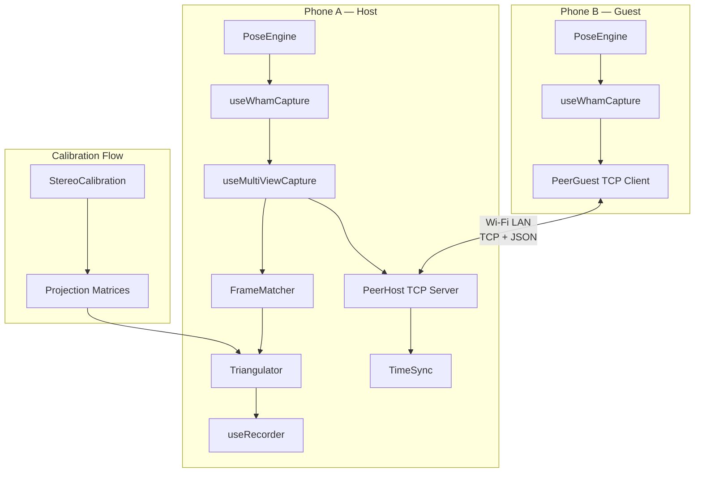

# Dual Camera Triangulation — Implementation Summary

## Status: ✅ All 6 Phases Implemented & Type-Checked

TypeScript compilation passes with **zero errors** (`npx tsc --noEmit`).

---

## Created Files (12 new)

### Faz 1: P2P Networking
| File | Purpose |
|------|---------|
| [PeerProtocol.ts](file:///Users/burakcoskun/Mocapexpo/src/infra/networking/PeerProtocol.ts) | Message types, wire format (length-prefixed JSON/TCP), Float32Array↔base64 encoding, MessageFramer |
| [TimeSync.ts](file:///Users/burakcoskun/Mocapexpo/src/infra/networking/TimeSync.ts) | NTP-like clock offset estimation with outlier filtering |
| [PeerHost.ts](file:///Users/burakcoskun/Mocapexpo/src/infra/networking/PeerHost.ts) | TCP server on host phone — handshake, time sync, keepalive, frame relay |
| [PeerGuest.ts](file:///Users/burakcoskun/Mocapexpo/src/infra/networking/PeerGuest.ts) | TCP client — connects to host, sends landmarks, auto-reconnect |

### Faz 2: Stereo Calibration
| File | Purpose |
|------|---------|
| [StereoCalibration.ts](file:///Users/burakcoskun/Mocapexpo/src/domain/mocap/pipeline/calibration/StereoCalibration.ts) | 8-point algorithm for Fundamental Matrix, Essential Matrix decomposition, quality scoring |
| [StereoCalibrationWizard.tsx](file:///Users/burakcoskun/Mocapexpo/src/features/capture/components/StereoCalibrationWizard.tsx) | 3-step calibration UI wizard |

### Faz 3: Triangulation Pipeline
| File | Purpose |
|------|---------|
| [Triangulator.ts](file:///Users/burakcoskun/Mocapexpo/src/domain/mocap/pipeline/triangulation/Triangulator.ts) | DLT triangulation with Jacobi SVD, projection matrix helpers |
| [FrameMatcher.ts](file:///Users/burakcoskun/Mocapexpo/src/domain/mocap/pipeline/triangulation/FrameMatcher.ts) | Timestamp-based frame pairing with clock offset correction |
| [MultiViewPoseFrame.ts](file:///Users/burakcoskun/Mocapexpo/src/domain/mocap/models/MultiViewPoseFrame.ts) | Type definitions for multi-view data |

### Faz 4: Multi-View State & Hooks
| File | Purpose |
|------|---------|
| [multiViewStore.ts](file:///Users/burakcoskun/Mocapexpo/src/features/capture/state/multiViewStore.ts) | Zustand store for dual-camera state |
| [useMultiViewCapture.ts](file:///Users/burakcoskun/Mocapexpo/src/features/capture/hooks/useMultiViewCapture.ts) | Orchestration hook — host/guest lifecycle, frame matching, triangulation |

### Faz 5: UI
| File | Purpose |
|------|---------|
| [MultiViewSetupScreen.tsx](file:///Users/burakcoskun/Mocapexpo/src/features/capture/screens/MultiViewSetupScreen.tsx) | Role selection, IP config, connection flow |

## Modified Files (6)

| File | Changes |
|------|---------|
| [routes.ts](file:///Users/burakcoskun/Mocapexpo/src/app/navigation/routes.ts) | Added `MultiViewSetup` route |
| [RootNavigator.tsx](file:///Users/burakcoskun/Mocapexpo/src/app/navigation/RootNavigator.tsx) | Registered `MultiViewSetupScreen` |
| [Take.ts](file:///Users/burakcoskun/Mocapexpo/src/domain/mocap/models/Take.ts) | Added `captureMode`, `stereoCalibration`, `viewCount` fields |
| [PoseFrame.ts](file:///Users/burakcoskun/Mocapexpo/src/domain/mocap/models/PoseFrame.ts) | Added `sourceDevice`, `triangulated` fields |
| [CaptureScreen.tsx](file:///Users/burakcoskun/Mocapexpo/src/features/capture/screens/CaptureScreen.tsx) | Added "Dual Camera" button navigating to MultiViewSetup |
| [package.json](file:///Users/burakcoskun/Mocapexpo/package.json) | Added `react-native-tcp-socket` dependency |

## Architecture Diagram

## Next Steps (not yet implemented)

> [!NOTE]
> The following items remain for future work:

1. **Network Info**: Get device local IP address automatically (currently placeholder `0.0.0.0` — needs a library like `react-native-network-info` or reading from native)
2. **Native rebuild**: `react-native-tcp-socket` requires `pod install` (iOS) and Gradle sync (Android)
3. **Integration testing**: Test with two physical devices on the same Wi-Fi
4. **OverlaySkeleton.tsx**: Update to render triangulated 3D skeleton when in multi-view mode
5. **useRecorder.ts**: Actually serialize `MultiViewPoseFrame` during recording
6. **Camera FOV detection**: Auto-detect phone camera FOV for better intrinsic estimation
